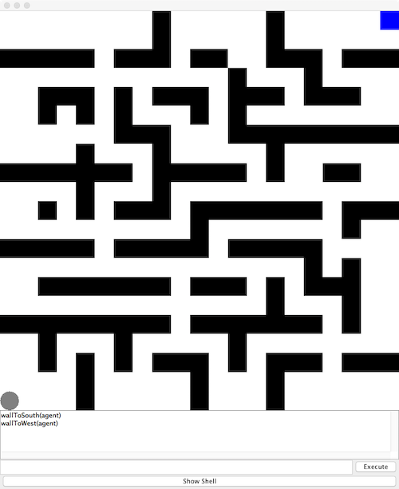
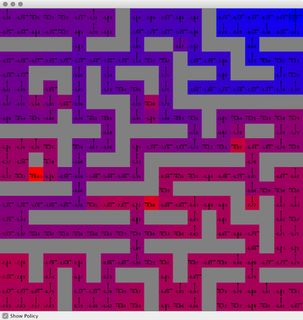

# Grid World MDP
Markov Decision Process experiment and analysis using Burlap's grid world


## Usage
Steps necessary to re-run this application:

  1. Update the Configuration class.  All pertinent settings are stored in this class such as which
  domain to build and which type of agent or planner to utilize in creating the best value function.
  
  2. Compile the JAR using the Gradle wrapper and then execute the application.  The following 
  commands will handle this, from the project root directory:
  
  ```
  ./gradlew clean build
  java -jar build/libs/mdp.jar
  ```


## Analysis
A Markov decision process (MDP) is the process of modeling decision making for situations that are 
stochastic in nature.  The grid world is the simplest representation of this process.  The goal 
of this experiment and analysis is to showcase various methods to evaluate different domains (i.e. 
grid worlds) as well as reinforcement learning's impact on solving MDP's.

### Grid World
Solving MDP's is made most apparent utilizing the canonical example of grid worlds.  The agent lives
in a grid and moves semi-stochastically through each square.  There are usually obstacles and 
various positive/negative reward locations

#### Small Grid World
The first domain studied is the small gride world.  Consisting of only a 10 x 10 grid, the small 
grid world has 4 walls with one entry point in each as well as a single start and finish point. 
This basic setup is setup to easily illustrate the effectiveness of each planning/learning method 
as well as a good domain to test against correct implementation.


#### Large Grid World
The second domain analyzed is a larger much more complex of the grid world.  Consisting of a 
21 x 21 square grid, the larg grid world contains multiple walls, dead ends, negative reward 
obstacles and the same single start and finish point.  This more complex setup truly showcases
the capabilities of the planning and learning algorithms analyzed below



### Planning/Learning
Planning an optimal path can be done in different ways, we'll focus on value iteration and policy
iteration.  A learning agent will then be constructed to 'discover' the optimal path and compared
with the planners to see how close to the actual values it can get

#### Value Iteration
Value iteration involves starting a specific point (usually the end point) and working backwards
until all values are calculated, the optimal value function is discovered, and propogated 
throughout the policy (converged/optimal).  Value iteration is simple to implement but much more
computationally heavy.

Here is the optimal policy for the small grid world:


#### Policy Iteration
Policy iteration on the other hand involves manipulating the policy directly until the optimal 
policy is discovered.  Policy iteration is more complicated to implement but converges much quicker
and therefore less computationally heavy.

Below is the optimal policy for the large grid world.  As you can see there is negative reward 
squares (or hazards) that the optimal policy pushes to avoid.


#### Reinforcement Learning (Q-Learning)
Reinforcement learning involves leaning on the premise of maximizing a reward, and consequently 
works in conjunction very well with MDP's.  For this experiment Q-learning was utilized.  Q-learning
is a model free algorithm, i.e. does not require a model of the environment).  It starts at an 
initial state with a random assumption of the domain and takes a specific action (based on variou
'discovery' algorithms), remember the reward that it received.  The Q-learning agent works through
the domain until a near optimal policy is achieved.  Optimal policy can be achieved but as shown
below becomes more difficult over time, depending on the discovery algorithm. 

##### Q-learning Small Grid World Results

Below are the results and policy discovered by the Q-learning agent on the small grid world.  The 
agent focused on maintaining the quickest path pretty early on through the trial which explains
why the policy discovered only partially matches the planners above.


##### Q-learning Large Grid World Results

The large grid world, however, involves much more complexities are one very optimal path (versus
the 2 options available on the small).  Due to this the Q-learning agent wasn't able to steadily
achieve the maximimum reward as quickly thus allowing it to explore the domain more.  This explains
why the policy discovered looks much more similar to the planner's.





